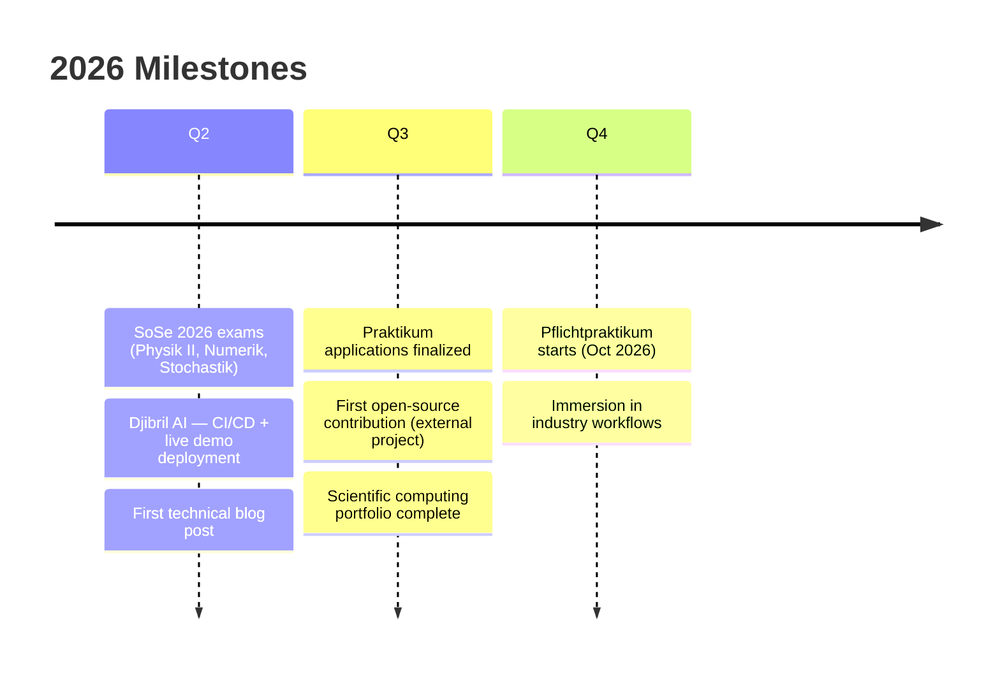

<div align="center">

<!-- BANNER -->


<!-- TYPING SVG -->
<a href="https://git.io/typing-svg"></a>

<br/>

<!-- QUICK BADGES -->
[](https://www.th-nuernberg.de/)
[](https://algosphere-quant.com)
[](#-current-focus)

</div>

---

## 🧑‍💻 About Me

```yaml
name: Emmanuel Nana Nana
age: 20
location: Nürnberg, Germany
education: B.Sc. Applied Mathematics & Physics (TH Nürnberg) — 4th semester
business: Founder @ AlgoSphere Quant (14 commercial products on MQL5 Marketplace)
languages:
  spoken: French (native) · German (C1/DSH-2) · English (B2+) · Spanish (A1) · Russian (A1)
  code: Python · TypeScript · C/C++ · C# · MQL5 · Java
seeking: Pflichtpraktikum WS 2026/27 — Data Science / ML / Software Dev
focus:
  - Numerical Simulation & Scientific Computing
  - Data Science & Machine Learning
  - Full-Stack Development (FastAPI + React/TypeScript)
  - Algorithmic Trading & Quantitative Finance
philosophy: "The best way to understand something is to implement it."
```

I'm a hands-on student who turns every concept into **code**, a **visualization**, or a **trading system**.

---

## 🛠️ Tech Stack

<div align="center">

**Languages**


**Data Science & ML**


**Web & Frameworks**


**Infrastructure**


</div>

---

## 📌 Featured Projects

<div align="center">

| | Repo | Description | Tech | |
|---|---|---|---|---|
| 🛢️ | [**Djibril-AI**](https://github.com/e49nana/Djibril-AI) | AI crude oil trading — geopolitical scoring via Claude API, real-time dashboard, 98 tests | FastAPI · React/TS · Docker |  |
| 💹 | [**Algorithmic-Trading**](https://github.com/e49nana/Algorithmic-trading) | Open-source trading tools + AlgoSphere Quant showcase (14 products) | MQL5 · C# · Python |   |
| 🤖 | [**Hansi AI Goggles**](https://github.com/e49nana/hansi-ai-goggles) | Embedded AI vision — ESP32-S3 smart glasses with real-time recognition | C/C++ · React Native · GPT-4o |  |
| 🔬 | [**Scientific-Simulation-Project**](https://github.com/e49nana/Scientific-Simulation-Project) | SVD image compression, numerical precision, symbolic math, robotics | Python · NumPy · SciPy |  |
| 📘 | [**AMP-Studies**](https://github.com/e49nana/AMP-Studies) | B.Sc. coursework: cheatsheets, implementations, notes by semester | Python · LaTeX |  |

</div>

---

## 🎯 Current Focus

**SoSe 2026** — Completing remaining exams (Numerik, Stochastik, Funktionale Analysis, Physik II/III) to reach 90 LP and unlock Pflichtpraktikum eligibility for WS 2026/27.

**Seeking Praktikum** (Oct 2026 – Mar 2027) in the Nürnberg/Erlangen/Fürth area in one of these domains: Data Science & ML, Software Development, Embedded Systems/IoT, or Quantitative Finance.

---

## 🗺️ Roadmap


```mermaid
timeline
    title 2026 Milestones
    Q2 : SoSe 2026 exams (Physik II, Numerik, Stochastik)
       : Djibril AI — CI/CD + live demo deployment
       : First technical blog post
    Q3 : Praktikum applications finalized
       : First open-source contribution (external project)
       : Scientific computing portfolio complete
    Q4 : Pflichtpraktikum starts (Oct 2026)
       : Immersion in industry workflows
```

---

## 💡 Philosophy

<div align="center">

> *"I believe in learning by building.*
> *Every concept I study becomes code, a visualization, or a trading system."*

</div>

---

## 📊 GitHub Stats

<div align="center">


</div>

---

<div align="center">


</div>
