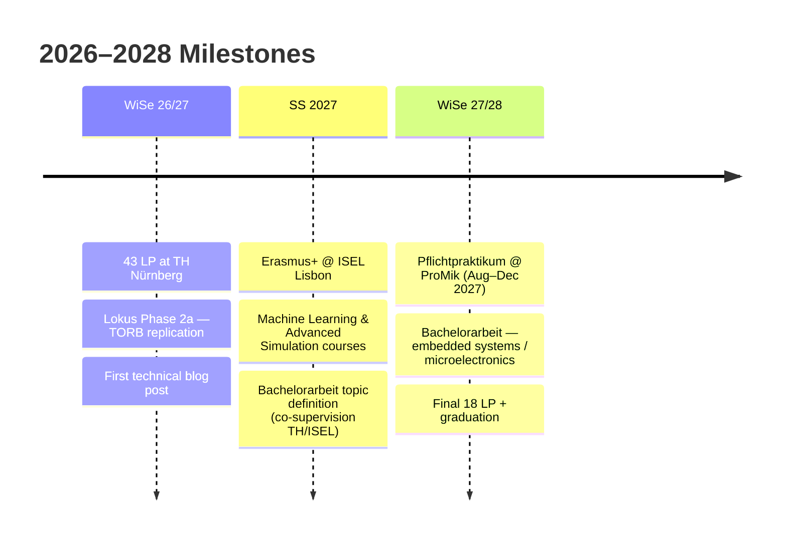
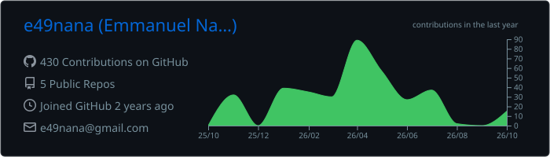
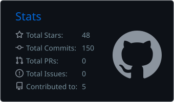
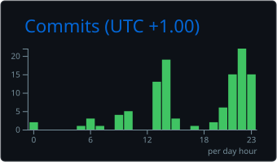
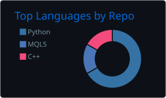
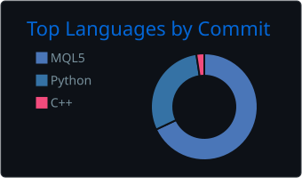

<div align="center">

<!-- BANNER -->


<!-- TYPING SVG -->
<a href="https://git.io/typing-svg"></a>

<br/>

<!-- QUICK BADGES -->
[](https://www.th-nuernberg.de/)
[](https://algosphere-quant.com)
[](#-current-focus)

</div>

---

## 🧑‍💻 About Me

```yaml
name: Emmanuel Nana Nana
age: 20
location: Nürnberg, Germany
education: B.Sc. Applied Mathematics & Physics (TH Nürnberg) — 5th semester (WiSe 26/27)
business: Founder @ AlgoSphere Quant (14 commercial products on MQL5 Marketplace)
languages:
  spoken: French (native) · German (C1 / TELC C1 Hochschule) · English (B2+ / DAAD) · Spanish (A1) · Russian (A1)
  code: Python · TypeScript · C/C++ · C# · MQL5 · Java
upcoming:
  - Erasmus+ @ ISEL Lisbon (SS 2027)
  - Pflichtpraktikum @ ProMik — Embedded Systems & Test Engineering (Aug 2027)
research: Lokus — walk-forward backtesting of intraday futures strategies
focus:
  - Embedded Systems & Hardware-near Programming (C/C++, ESP32)
  - Numerical Simulation & Scientific Computing
  - Data Science & Machine Learning
  - Algorithmic Trading & Quantitative Finance
philosophy: "The best way to understand something is to implement it."
```

I'm a hands-on student who turns every concept into **code**, a **visualization**, or a **trading system**.

---

## 🛠️ Tech Stack

<div align="center">

**Languages**


**Embedded**


**Data Science & ML**


**Web & Frameworks**


**Infrastructure**


</div>

---

## 📌 Featured Projects

<div align="center">

| | Repo | Description | Tech | |
|---|---|---|---|---|
| 🤖 | [**Hansi AI Goggles**](https://github.com/e49nana/hansi-ai-goggles) | Embedded AI vision — ESP32-S3 smart glasses: camera driver, firmware, BLE/Wi-Fi pipeline, real-time recognition | Embedded C/C++ · ESP32-S3 · React Native |  |
| 📈 | [**lokus-research**](https://github.com/e49nana/lokus-research) | Quantitative research — walk-forward backtesting of intraday futures strategies (428 tests, bootstrap CIs, Bonferroni) | Python · pandas · pytest |  |
| 🛢️ | [**Djibril-AI**](https://github.com/e49nana/Djibril-AI) | AI crude oil trading — geopolitical scoring via Claude API, real-time dashboard, 98 tests | FastAPI · React/TS · Docker |  |
| 💹 | [**Algorithmic-Trading**](https://github.com/e49nana/Algorithmic-trading) | Open-source trading tools + AlgoSphere Quant showcase (14 commercial products) | MQL5 · C# · Python |   |
| 🔬 | [**Scientific-Simulation-Project**](https://github.com/e49nana/Scientific-Simulation-Project) | SVD image compression, numerical precision, symbolic math, robotics | Python · NumPy · SciPy |  |

</div>

---

## 🎯 Current Focus

**WiSe 2026/27** — 43 LP planned this semester including Physik IV/V, Algorithmen & Datenstrukturen, Numerik 2, Programmierung I & II, and electives.

**Erasmus+ @ ISEL Lisbon (SS 2027)** — Confirmed nomination at the Instituto Politécnico de Lisboa. Courses in Machine Learning, Graphs & Networks, Advanced Modelling & Simulation. Learning Agreement in preparation.

**Pflichtpraktikum (Aug 2027)** — Planned at ProMik Programmiersysteme, Nürnberg — embedded systems, flash programming & test engineering for electronic control units.

**Lokus Research** — Walk-forward backtesting of intraday futures strategies on CME micro futures (MES/MNQ) under strict statistical protocol.

---

## 🗺️ Roadmap


```mermaid
timeline
    title 2026–2028 Milestones
    WiSe 26/27 : 43 LP at TH Nürnberg
               : Lokus Phase 2a — TORB replication
               : First technical blog post
    SS 2027    : Erasmus+ @ ISEL Lisbon
               : Machine Learning & Advanced Simulation courses
               : Bachelorarbeit topic definition (co-supervision TH/ISEL)
    WiSe 27/28 : Pflichtpraktikum @ ProMik (Aug–Dec 2027)
               : Bachelorarbeit — embedded systems / microelectronics
               : Final 18 LP + graduation
```

---

## 💡 Philosophy

<div align="center">

> *"I believe in learning by building.*
> *Every concept I study becomes code, a visualization, or a trading system."*

</div>

---

## 📊 GitHub Stats

<div align="center">

[](https://ghfind.com/en/u/e49nana)









[](https://git.io/streak-stats)

</div>

---

<div align="center">


</div>
