<div align="center">

<!-- BANNER -->


<!-- TYPING SVG -->
<a href="https://git.io/typing-svg"></a>

<br/>

<!-- QUICK BADGES -->
[](https://www.th-nuernberg.de/)
[](#-roadmap)
[](#-roadmap)

</div>

---

## 🧑‍💻 About Me

```yaml
name: Emmanuel Nana Nana
location: Nürnberg, Germany
education: B.Sc. Applied Mathematics & Physics (TH Nürnberg) — 4th semester
focus: Numerical Simulation • Scientific Computing • Algorithmic Trading • AI/ML
target: MSc @ TUM (CSE / Math in Data Science) → Double MSc @ École Polytechnique (MScT)
philosophy: "The best way to understand something is to implement it."
```

I'm a hands-on student who turns every concept into **code**, a **visualization**, or a **trading indicator**.  
My strongest results are in applied & computational modules — **1.7 in Simulation Seminar** and **1.7 in Physics Lab** this semester.  
Currently building toward **MSc @ TUM** with a double degree at **École Polytechnique** via the EuroTech program.

---

## 🛠️ Tech Stack

<div align="center">

**Languages**


**Scientific Computing & ML**


**Platforms & Tools**


</div>

---

## 📌 Featured Projects

<div align="center">

| | Repo | Description | Tech | |
|---|---|---|---|---|
| 🔬 | [**Scientific-Simulation-Project**](https://github.com/e49nana/Scientific-Simulation-Project) | Physics-based modelling, PDE solvers & visualization | Python · R · C# |   |
| 💹 | [**Algorithmic-Trading**](https://github.com/e49nana/Algorithmic-trading) | Expert Advisors, indicators & backtested strategies | MQL5 · C# |   |
| 📚 | [**50-Projects-by-Difficulty**](https://github.com/e49nana/50-Programming-and-Technical-Projects-by-Difficulty-Level) | Practice roadmap & technical references | Markdown |   |
| 📘 | [**AMP-Studies**](https://github.com/e49nana/AMP-Studies) | Coursework, notebooks & semester projects | Python · MATLAB · LaTeX |  |
| 🚀 | [**Side-Activities**](https://github.com/e49nana/Side-Activities) | AI/ML experiments, demos & exploratory work | Python · TensorFlow |  |

</div>

### 🔜 Coming Next

| Project | Description | Target |
|---|---|---|
| 🌡️ PDE Solver Toolkit | Heat/wave equation solvers (FD, FEM) with interactive visualizations | SoSe 2026 |
| 📐 Numerical Optimization Lab | Gradient descent, Newton methods, constrained optimization | SoSe 2026 |
| 🧮 Linear Algebra Applications | Image compression (SVD), PageRank, spectral methods | WiSe 2026/27 |

---

## 📊 GitHub Stats

<div align="center">


<br/>

[](https://git.io/streak-stats)

</div>

---

## 🗺️ Roadmap

```mermaid
timeline
    title Academic & Project Trajectory
    section TH Nürnberg
        SoSe 2026 (Sem 4)   : 🔴 Physik II + PDE Solver Toolkit
                              : Numerical Optimization Lab
                              : Target ≤ 1.7 on applied modules
        WiSe 2026/27 (Sem 5) : 🟠 Advanced Numerics (FEM, PDE-constrained opt.)
                              : IELTS/TOEFL official test
                              : First technical report / poster
        SoSe 2027 (Sem 6)    : 🟡 International exchange OR R&D internship
                              : Full reproducible GitHub project
        WiSe 2027/28 (Sem 7) : 🟢 Bachelor capstone project
                              : TUM application prep (CV, reco letters)
        SoSe 2028 (Sem 8)    : 🔵 TUM admission + Bachelor defense
    section TUM & Polytechnique
        WiSe 2028/29          : 🎓 MSc @ TUM — PDEs, NumLinAlg, Optimization
        2029/30               : Double Degree prep → École Polytechnique
        2030/31               : 🇫🇷 MScT @ École Polytechnique (X)
        2031+                 : PhD cotutelle or R&D / DeepTech
```



---

## 💡 Philosophy

<div align="center">

> *"I believe in learning by building.*  
> *Every concept I study becomes code, a visualization, or a trading indicator.*  
> *The path from Nürnberg to TUM to Polytechnique is paved with implemented equations."*

</div>

---

## 📫 Connect

<div align="center">

[](mailto:nanaemmanuel49@gmail.com)
[](https://github.com/e49nana)

</div>

---

<div align="center">

<!-- VISITOR COUNTER -->


<!-- FOOTER WAVE -->


</div>
