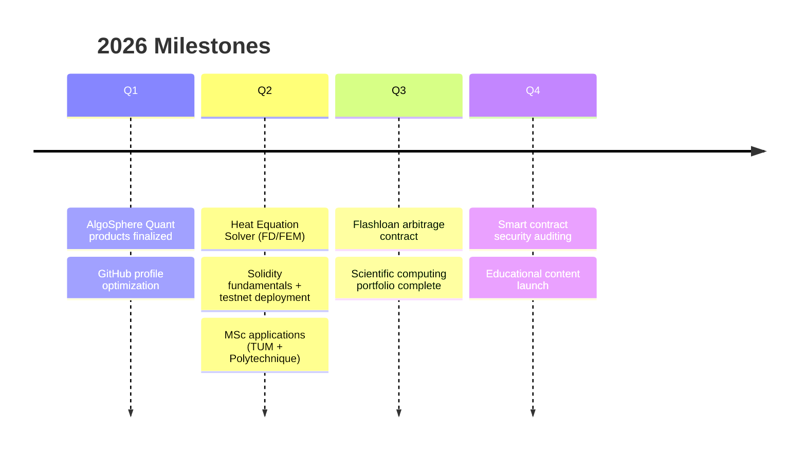

<div align="center">

<!-- BANNER -->


<!-- TYPING SVG -->
<a href="https://git.io/typing-svg"></a>

<br/>

<!-- QUICK BADGES -->
[](https://www.th-nuernberg.de/)
[](#-roadmap)
[](https://algosphere-quant.com)

</div>

---

## 🧑‍💻 About Me

```yaml
name: Emmanuel Nana Nana
location: Nürnberg, Germany
education: B.Sc. Applied Mathematics & Physics (TH Nürnberg) — 4th semester
business: Founder @ AlgoSphere Quant (MQL5 Marketplace)
focus:
  - Numerical Simulation & Scientific Computing
  - Algorithmic Trading (TradFi + DeFi)
  - Blockchain & Smart Contracts (learning Solidity)
philosophy: "The best way to understand something is to implement it."
```

I'm a hands-on student who turns every concept into **code**, a **visualization**, or a **trading system**.  
Currently building toward **MSc @ TUM** with an exchange at **École Polytechnique** via the EuroTech program.

---

## 🛠️ Tech Stack

<div align="center">

**Languages**


**Scientific Computing & ML**


**Blockchain & DeFi**


**Platforms & Tools**


</div>

---

## 📌 Featured Projects

<div align="center">

| | Repo | Description | Tech | |
|---|---|---|---|---|
| 🔬 | [**Scientific-Simulation-Project**](https://github.com/e49nana/Scientific-Simulation-Project) | Numerical computing & simulation notebooks | Python · NumPy · SymPy |   |
| 💹 | [**Algorithmic-Trading**](https://github.com/e49nana/Algorithmic-trading) | TradFi (MQL5/NT) + DeFi (Web3/Uniswap) trading tools | MQL5 · C# · Python · Web3.py |   |
| 📚 | [**50-Projects-by-Difficulty**](https://github.com/e49nana/50-Programming-and-Technical-Projects-by-Difficulty-Level) | Practice roadmap: programming, physics, math, AI | Markdown |   |
| 📘 | [**AMP-Studies**](https://github.com/e49nana/AMP-Studies) | B.Sc. coursework archive (semester by semester) | Python · MATLAB · LaTeX |  |
| 🚀 | [**Side-Activities**](https://github.com/e49nana/Side-Activities) | AI/ML experiments & demos | Python · TensorFlow |  |

</div>

---

## 📊 GitHub Stats

<div align="center">


<br/>

[](https://git.io/streak-stats)

</div>

---

## 🗺️ Roadmap



---

## 💡 Philosophy

<div align="center">

> *"I believe in learning by building.*  
> *Every concept I study becomes code, a visualization, or a trading system."*

</div>

---

<div align="center">


</div>
